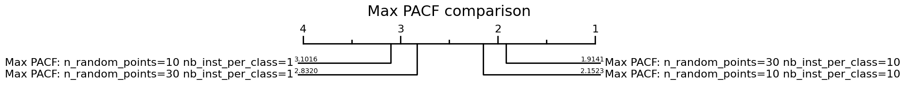

# RSAST: Random Scalable and Accurate Subsequence Transform for Time Series Classification

Random SAST (RSAST) is a method based on STC and SAST, that generates shapelets randomly, guided by certain statistical
criteria, reducing the search space of shapelets.


## Results RSAST

- [Results Default Split](./ExperimentationRSAST/results_default_split.csv)

- [Results 10 Resamplings](./ExperimentationRSAST/results_10resampling.csv)

- [Results Comparison RSAST](./ExperimentationRSAST/results_comparison_rsast.csv)

- [Execution time regarding the number of series](./ExperimentationRSAST/results_comparison_accuracy/df_overall_comparison_scalability_number_of_seriesLR.csv)

- [Execution time regarding series length](./ExperimentationRSAST/results_comparison_accuracy/df_overall_comparison_scalability_series_length.csv)


## RSAST, SAST and STC

### Critical difference diagram


### Pairwise accuracy comparison

|  |  |
| -------------------------------------------------- | ---------------------------------------------------- |


## Shapelet Approaches

### Critical difference diagram


### Pairwise accuracy comparison

|  |  |  |
| ----------------------------------------- | ------------------------------------------- | ------------------------------------------- |

## Alternative Length Methods

In order to explore another alternatives for the default length method of the shapelets (ACF&PACF) some supplementary length methods are examined: Max PACF and None.

### Critical difference diagram per length method

- The default behaviour implies chose all significant values from ACF and PACF tests.
 

- Max ACF, makes reference to the generation of subsequences considering solely the highest significant value from the Partial Autocorrelation Function (PACF).
 

- "None" variation, involves generating subsequences with a single random length chosen from the range between 3 and the size of the time series for each randomly selected instance.
 


### Critical difference diagram: Best Performance Comparison


## Scalability

- Regarding the length of time series:


- Regarding the number of time series in the dataset:


## Usage

```python

import os, numpy as np
from utils_sast import load_dataset, format_dataset
from sast import RSAST
from sklearn.linear_model import RidgeClassifierCV

ds='Coffee' # Chosing a dataset 
path=os.getcwd()+"/data"

ds_train , ds_test = load_dataset(ds_folder=path,ds_name=ds,shuffle=False)
X_test, y_test = format_dataset(ds_test)
X_train, y_train = format_dataset(ds_train)
clf = RidgeClassifierCV(alphas=np.logspace(-3, 3, 10))
rsast_ridge = RSAST(n_random_points=10, nb_inst_per_class=10, len_method="both", classifier=clf)
rsast_ridge.fit(X_train, y_train)
print('rsast score :', rsast_ridge.score(X_test, y_test))

```
